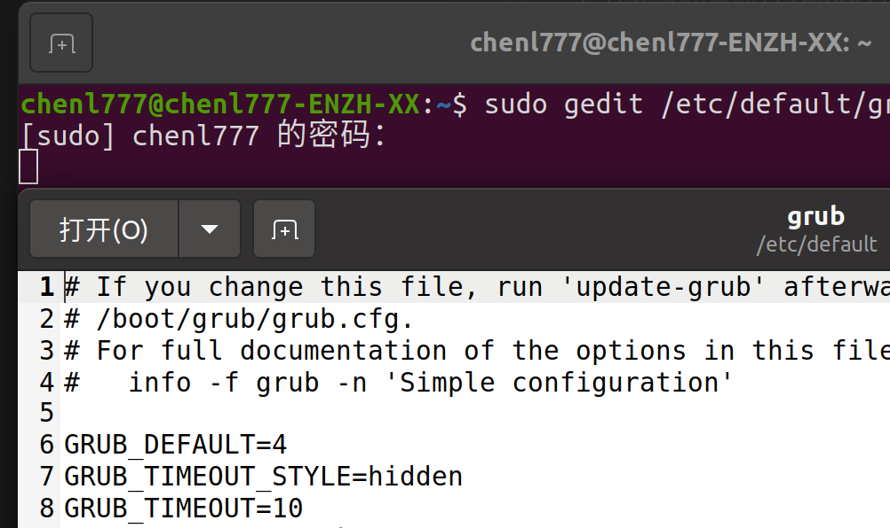

# Week1 实验报告
## 1.实验任务
1. 安装Windows+Ubuntu双系统，完成对应截图；
2. 安装并配置VSCode，在VSCode中运行C++的Hello world程序；
3. 学习Git核心命令，加入GitHub小组并将作业提交至对应仓库；
4. 编写Markdown实验报告，完整记操过程，问题与总结
## 2.实现过程（含主要步骤与截图）
### 2.1双系统安装
1. 前期准备：下载Ubuntu镜像并制作启动盘，调整BIOS设置；
2. 分区操作：手动划分EFI、SWAP、EXT4 Root分区；
3. 系统安装：完成Ubuntu安装后，配置GRUB启动菜单，确保双系统可正常切换；
4. 截图收集：！[手动分区](image/分区操作.png)
！[双系统界面](image/双系统截图.jpeg)
！[Ubuntu桌面](image/ubuntu桌面.png)

### 2.2 VSCode安装与配置
1. 安装VSCode：在Ubuntu终端执行指令完成VSCode安装；
2. 扩展安装：安装C/C++、Chinese (Simplified)等必要扩展；
3. 程序运行：编写Hello World C++程序，在VSCode中完成编译与运行，验证环境正常；
4. 截图收集！[扩展安装](image/扩展安装.png)
！[hello world c++程序](image/c++.png)
### 2.3 Git学习与作业上传
1. 环境配置：Ubuntu下安装git、vim、curl、build-essential工具；
2. 仓库操作：

   ◦ 进入项目文件夹：cd ~/hello world；

   ◦ 配置用户身份：
    git config --global user.name "ChenL777"
    
    git config --global user.email "770902703@qq.com"
   
   ◦ 提交代码：git add . → git commit -m "week1 submit"；

   ◦ 关联远程仓库：git branch -M main → git remote add origin https://github.com/2025BIUHcourse/2025bihcourse-classroom-group4-week1-homework-1-template.git；

◦ 推送作业：git push -u origin main（解决TLS连接异常后完成推送）；

3. 截图收集：！[安装常用工具](image/安装.png)
## 3.遇到的问题与解决方法
### 3.1
问题1：cd ~/hello world 提示“参数太多”

• 原因：文件夹名称包含空格，终端将空格前后识别为两个独立参数；

• 尝试过程：
1. 首次尝试cd "~/hello world"，因~在引号内失去“主目录”含义，提示“没有那个文件或目录”；
2. 改用转义空格方式cd ~/hello\ world，成功进入目标文件夹；

• 解决结论：终端中处理含空格路径，需用转义符\或Tab补全路径。
## 4.总结与心得
1. 系统层面：掌握Ubuntu双系统安装的核心步骤（分区、BIOS配置、GRUB设置），理解不同分区（EFI/SWAP/EXT4）的作用，能解决双系统启动相关基础问题；
2. 工具层面：熟悉Ubuntu终端基础指令，掌握VSCode配置C++开发环境的方法，理解Git“本地仓库-暂存-提交-远程推送”的核心流程；
3. 排障层面：学会从终端报错信息定位问题根源，针对路径、网络、认证类错误，能通过指令调整、方式替换（如HTTPS改SSH）解决问题；
4. 规范层面：掌握Markdown报告的编写规范与文件命名规则，理解实训任务中“过程记录+问题分析”的核心要求，提升实操复盘与文档编写能力。