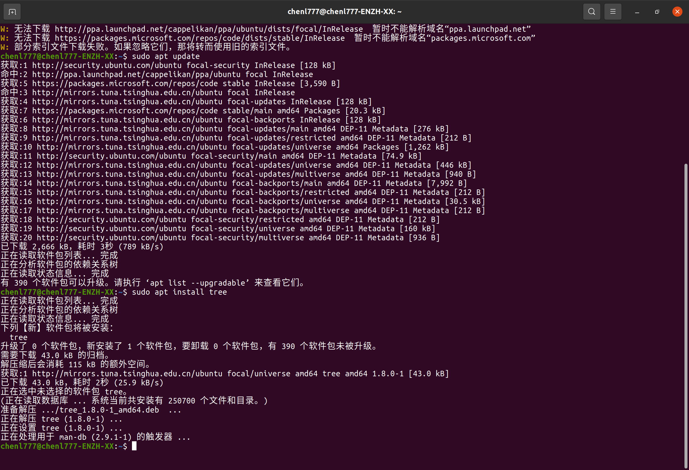
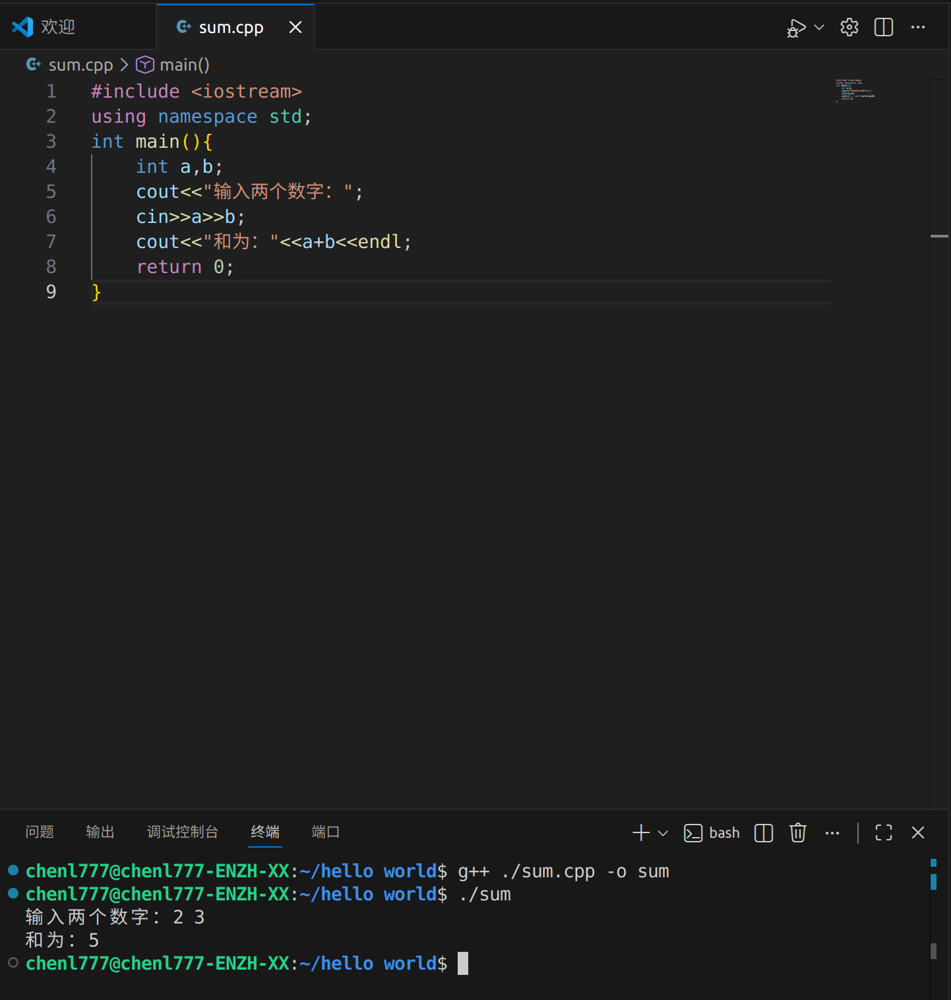
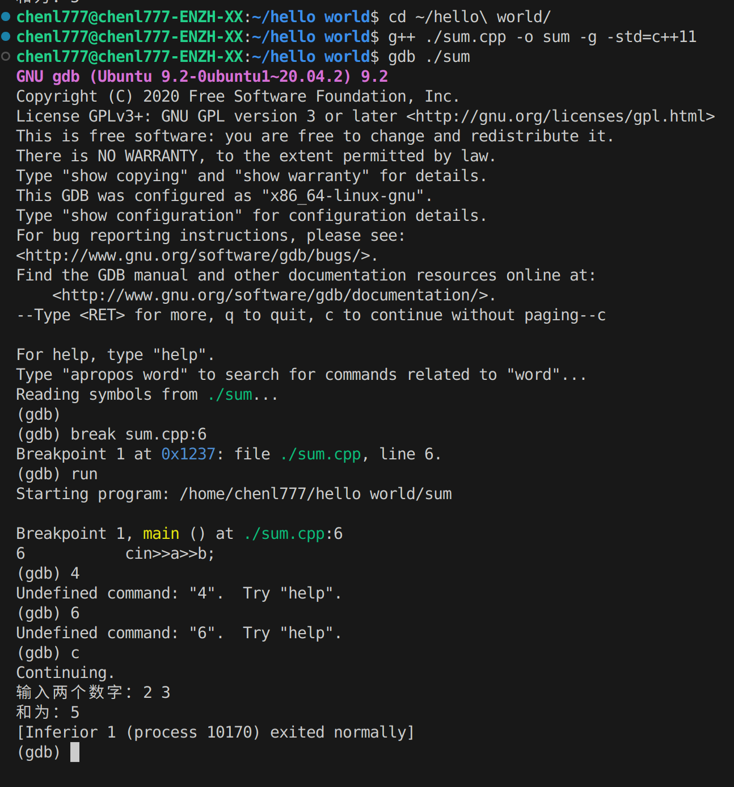
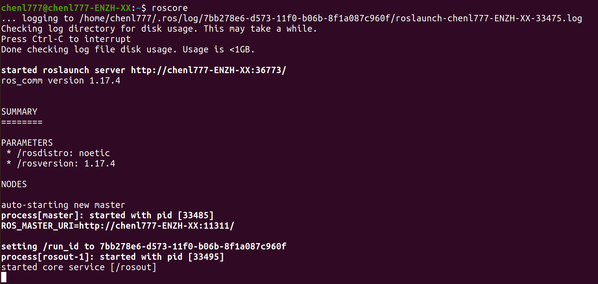
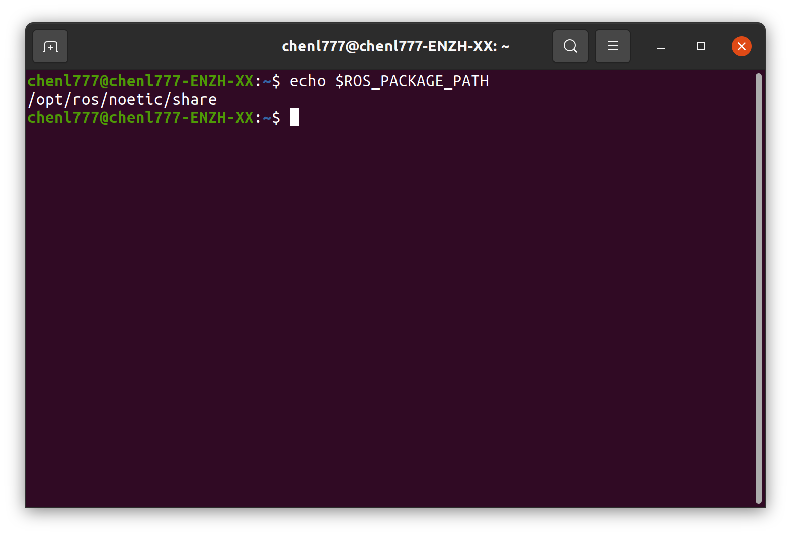
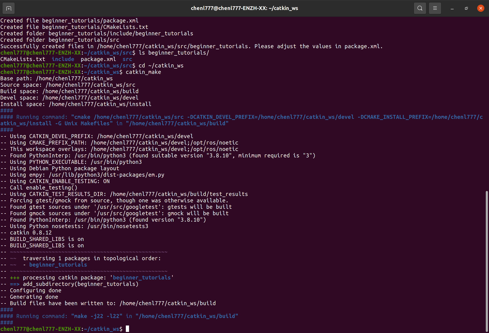
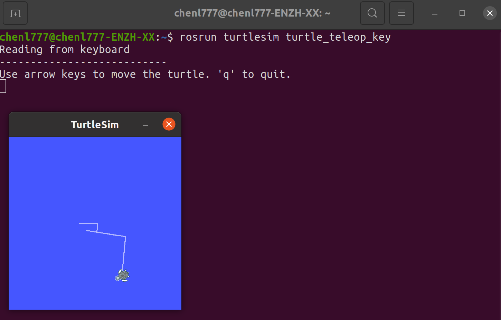
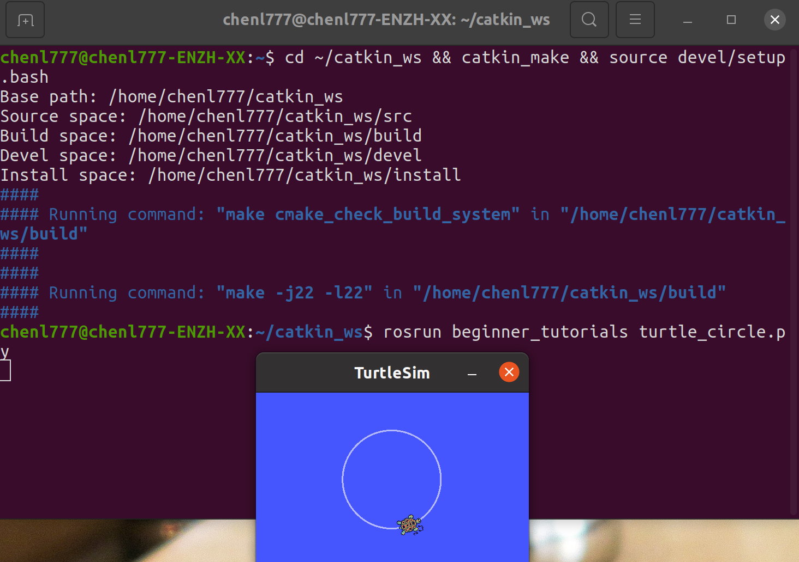
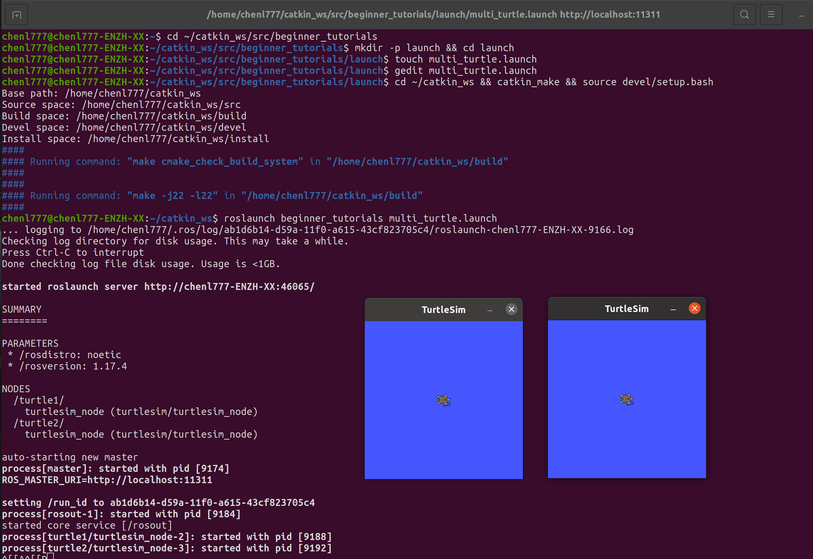
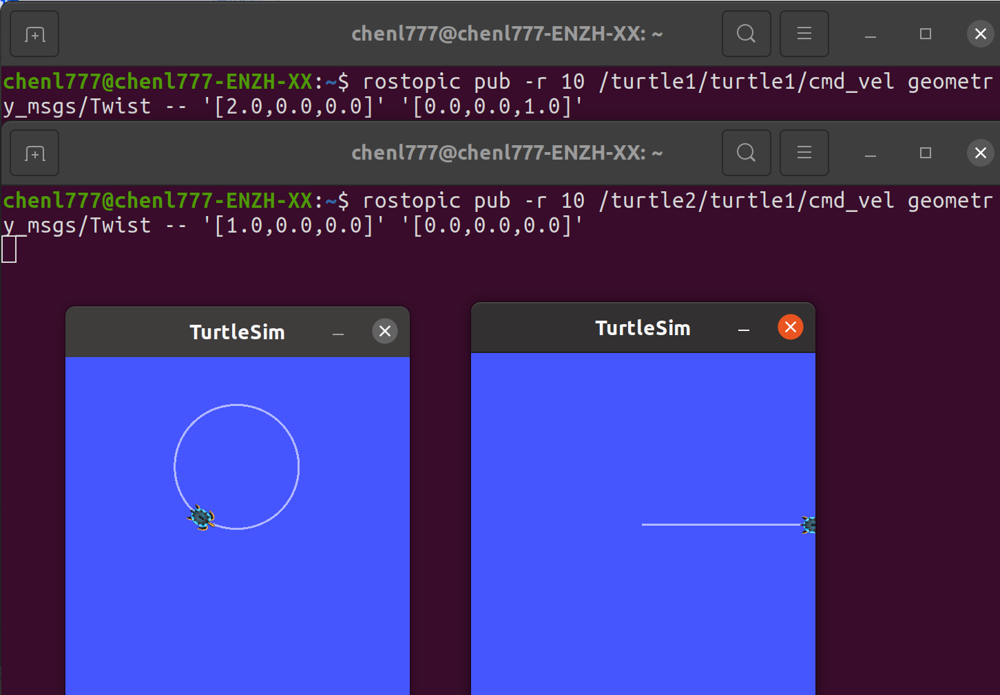

# Week2 实训任务实验报告
## 一、实训概述
本次实训覆盖 Linux 基础命令、Python/C++ 编程、ROS1 环境配置、CATKIN 工作空间搭建、Turtlesim 小乌龟控制及多乌龟 launch 可视化六大核心任务，旨在掌握 ROS 开发基础流程与核心工具的使用方法，完成从环境搭建到节点控制、可视化分析的全链路实操。
## 二、各任务实训内容与结果
### 任务 1：Linux 基础命令练习
#### 1.创建、移动、删除文件！[创建、移动、删除文件](./截图/创建移动删除文件截图.png)
#### 2.apt 安装软件
#### 3.使用ps与kill查看并终止进程截图！[查看并终止进程](./截图/ps与kill进程截图.png)
### 任务 2：Python 与 C++ 编程练习
#### 1.Python HelloWorld
#### 2.C++ 简单程序（输入数字求和）
#### 3.VSCode 调试截图
#### 4.g++ 编译截图
### 任务 3：ROS1 安装验证
#### 1.roscore 启动截图
#### 2.rosnode list 截图
#### 3.ROS 环境变量截图
### 任务 4：CATKIN 工作空间与功能包
#### 1.catkin_ws 创建与 catkin_make 编译截图
#### 2.beginner_tutorials 功能包截图
#### 3.HelloWorld 节点运行截图![HelloWorld 节点运行截图]
### 任务 5：Turtlesim 小乌龟基础
#### 1. 键盘控制 
#### 2.rostopic 控制  
#### 3.程序控制小乌龟 ！[Python/C++ 源码](./截图/5.3源码.png) 
### 任务 6：多乌龟 launch + rqt_graph
#### 1.创建一个 launch 文件[launch 文件源码](./截图/6launch文件源码.png)
#### 2.同时启动2只乌龟每只乌龟具有不同命名空间
#### 3.使用 rostopic 分别控制两只乌龟
#### 4.使用 rqt_graph 绘制通信关系图 使用 rqt_plot 绘制乌龟速度图![rqt_graph 截图]
